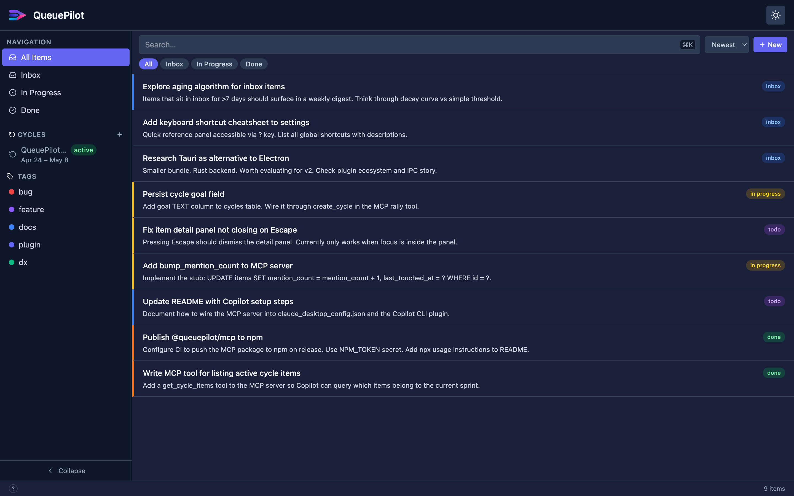

<p align="center">
  
</p>

<h1 align="center">QueuePilot</h1>

<p align="center">
  <strong>Stop switching context. Start shipping faster.</strong><br/>
  QueuePilot is a local-first task manager that plugs directly into Copilot CLI, so your AI pair always knows what you're working on.
</p>

<p align="center">
  <a href="LICENSE"></a>
  <a href="CONTRIBUTING.md"></a>
  <a href="https://www.typescriptlang.org/"></a>
  
</p>

---

<p align="center">
  
</p>

*3-pane layout: sidebar (cycles, tags, saved filters) → item list → drag-resizable detail panel.*

---

## What is QueuePilot?

QueuePilot is a local Electron desktop app and a Copilot CLI plugin that work together. The app is your persistent inbox: capture ideas, organise work into cycles, and track what matters. The plugin bridges that directly into Copilot CLI sessions, so Copilot knows what you're working on and what's waiting, without you ever switching context or repeating yourself.

No cloud account. No telemetry. Everything lives in a local SQLite file.

---

## Copilot CLI plugin

Install once and Copilot gains five skills that read and write your QueuePilot database in real time:

```bash
# From GitHub (recommended)
copilot plugin install kevingvand/queuepilot:plugin

# Via the QueuePilot marketplace
copilot plugin marketplace add kevingvand/queuepilot
copilot plugin install qp@queuepilot

# From a local clone
copilot plugin install /path/to/queuepilot/plugin
```

The MCP server (`@queuepilot/mcp-server`) is downloaded automatically via `npx` on first use.

| Skill | Trigger | What it does |
|-------|---------|--------------|
| `qp:brief` | "what's active", "orient me" | Active cycle, in-progress items, aging inbox |
| `qp:triage` | "triage my inbox" | Walk through inbox items one by one |
| `qp:rally` | "create a cycle" | Group items into a focused work cycle |
| `qp:park` | "park this idea" | Capture a thought to QP without leaving the session |
| `qp:pick` | "work on X" | Load an item or cycle into Copilot context |

See [plugin/README.md](plugin/README.md) for full setup, environment variables, and configuration.

---

## Highlights

- **Copilot-native**: MCP plugin bridges your task database directly into Copilot CLI context
- **Local-first**: Every operation hits a local SQLite file; sub-millisecond reads, fully offline
- **Zero account**: No signup, no telemetry, no cloud dependency
- **Cycles**: Organise work into focused sprints; active cycle surfaces automatically in Copilot
- **Full item model**: Status workflow, priority, due dates, tags, sub-tasks, and relationships
- **Command palette**: `Cmd+K` to create, navigate, filter, and change status without the mouse
- **Keyboard-driven**: `C` create · `E` edit · `J/K` navigate · `S` status · `T` tag · `?` overlay
- **Portable data**: SQLite file you own; put it in a git repo, encrypted volume, or Dropbox

---

## Quick start

```bash
git clone https://github.com/kevingvand/queuepilot.git
cd queuepilot
pnpm install
pnpm dev
```

Node.js ≥ 20 and pnpm ≥ 9 are required. On first launch, QueuePilot creates the database automatically.

---

## Status

**v0.1, early alpha.** Core data model, API layer, and 3-pane shell are working. Not production-ready. See [ROADMAP.md](ROADMAP.md) for what ships next.

---

## Architecture

pnpm monorepo with one Electron app and two shared packages. The Node.js main process owns SQLite (via `better-sqlite3` + Drizzle ORM) and a Hono HTTP server. The React renderer talks to it via typed IPC, no raw `fetch`, no untyped channels.

```
queuepilot/
├── apps/desktop/           ← Electron app (electron-forge + electron-vite)
│   └── src/
│       ├── main/           ← SQLite, Hono API, background workers
│       ├── preload/        ← contextBridge + typed IPC channel definitions
│       └── renderer/       ← React 19 + Vite, vertical feature slices
├── packages/
│   ├── core/               ← Drizzle schema, Zod types, shared domain logic
│   └── ingestion/          ← Source adapters (Telegram, webhook, ...)
└── plugin/                 ← Copilot CLI plugin (MCP server + 5 skills)
```

---

## Contributing

PRs are welcome. Read [CONTRIBUTING.md](CONTRIBUTING.md) for branch strategy, commit format, and code conventions. Check [ROADMAP.md](ROADMAP.md) for what's planned. Open an issue to discuss scope before starting anything non-trivial.

---

## License

MIT. See [LICENSE](LICENSE).
