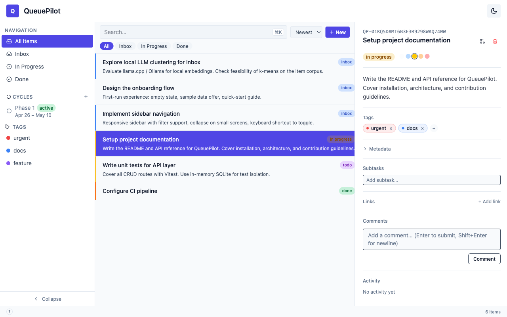

<p align="center">
  
</p>

<h1 align="center">QueuePilot</h1>

<p align="center">
  Local-first task and idea manager for developers and teams.<br/>
  <strong>Your inbox. Your data. Your machine.</strong>
</p>

<p align="center">
  <a href="LICENSE"></a>
  <a href="CONTRIBUTING.md"></a>
  <a href="https://www.typescriptlang.org/"></a>
  
</p>

---

## Why this exists

Every mainstream task manager requires a cloud account, leaks data through telemetry, or becomes a read-only brick offline. QueuePilot fixes that. Every operation completes against a local SQLite file — sub-millisecond reads, no network round-trip. Your data lives wherever you put it: a git repo, an encrypted volume, a Dropbox folder. No account required. No telemetry. Fully air-gap capable.

---

## Status

**v0.1 — early alpha.** The core data model, API layer, and 3-pane shell are working. This is not production-ready. There are rough edges. See [ROADMAP.md](ROADMAP.md) for what ships next.

---

## Screenshot



*3-pane layout: sidebar (sources, cycles, tags, saved filters) → item list → drag-resizable detail panel.*

---

## Features

**What works today (v0.1)**
- 3-pane shell — sidebar, item list, and drag-resizable detail panel; collapses gracefully to icon strip on narrower windows
- Full item model — title, body, status workflow (`inbox → triaged → in_progress → done | discarded | archived`), priority, due/scheduled/start dates, estimate
- Tags, cycles, sub-tasks, item relationships (`blocks`, `blocked-by`, `relates-to`, `duplicate`)
- Audit trail — every state change written to `item_events`
- Saved filters as smart lists in the sidebar
- Command palette (`Cmd+K`) — create, navigate, filter, change status
- Keyboard shortcuts — `C` create, `E` edit, `D` discard, `S` status, `T` tag, `J/K` navigate, `?` overlay
- Dark and light themes (indigo accent, system font stack)
- SQLite database you can query directly — portable, no migration lock-in
- `--data-dir` flag to point at any path from first boot

**Planned (see [ROADMAP.md](ROADMAP.md))**
- Telegram bot ingestor and generic webhook receiver (v0.3)
- Semantic search and duplicate detection via `all-MiniLM-L6-v2` (v1.0)
- GitHub Issues, GitLab Issues, and Jira Cloud bidirectional sync (post-v1.0)
- Optional local AI via Ollama — auto-tag, priority scoring, sub-task generation (post-v1.0)

---

## Quick start

```bash
git clone https://github.com/kevingvand/queuepilot.git
cd queuepilot
pnpm install
pnpm run db:migrate
pnpm dev
```

Node.js ≥ 20 and pnpm ≥ 9 are required.

---

## Architecture

QueuePilot is a pnpm monorepo with a single Electron desktop app and two shared packages. The Node.js main process owns the SQLite database (via `better-sqlite3` + Drizzle ORM), a Hono HTTP server, and all background workers. The React renderer communicates with the main process exclusively through typed Hono RPC — no raw `fetch` calls, no untyped IPC channels. `packages/core` holds the Drizzle schema and Zod domain types; `packages/ingestion` holds the source adapter contracts and implementations.

```
queuepilot/
├── apps/desktop/           ← Electron app (electron-forge + electron-vite)
│   └── src/
│       ├── main/           ← Node.js: SQLite, Hono API, background workers
│       ├── preload/        ← contextBridge and typed IPC channel definitions
│       └── renderer/       ← React 19 + Vite, organised by feature slice
│           └── features/
│               ├── shell/  ← 3-pane layout, command palette, keyboard shortcuts
│               └── items/  ← item list, detail, dialogs, cycles, saved filters
├── packages/
│   ├── core/               ← Drizzle schema, Zod types, shared domain logic
│   └── ingestion/          ← Source adapters (Telegram, webhook, ...)
└── .github/                ← CI pipeline, issue templates, PR template
```

The renderer is structured as Vertical Slices — each feature folder owns its full stack from API query hooks to UI components.

---

## Development

See [CONTRIBUTING.md](CONTRIBUTING.md) for step-by-step setup, test commands, and code conventions.

---

## Contributing

PRs are welcome. Read [CONTRIBUTING.md](CONTRIBUTING.md) for branch strategy, commit format, and code standards. Check [ROADMAP.md](ROADMAP.md) for what's planned — open an issue to discuss scope before starting anything non-trivial.

---

## License

MIT — see [LICENSE](LICENSE).
